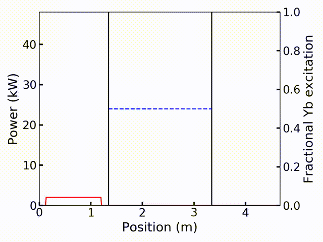
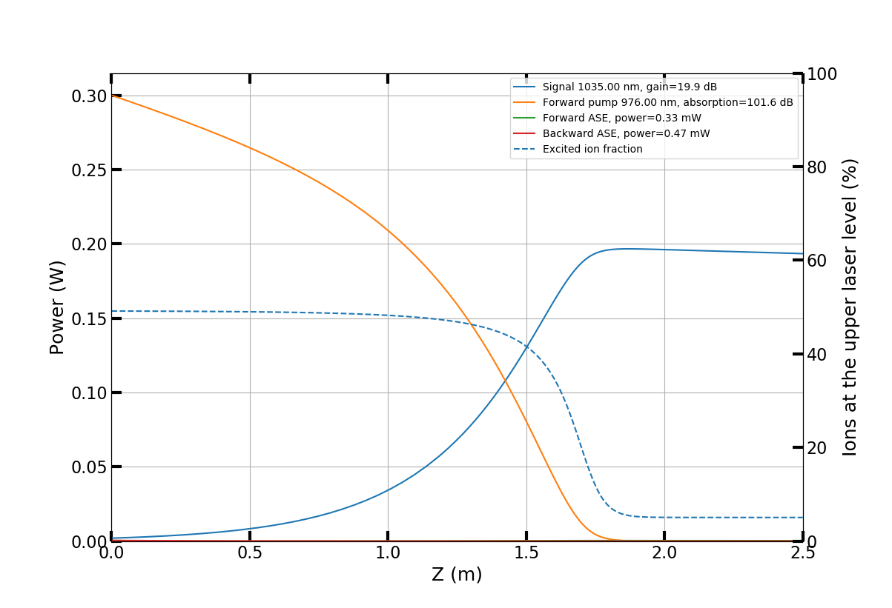
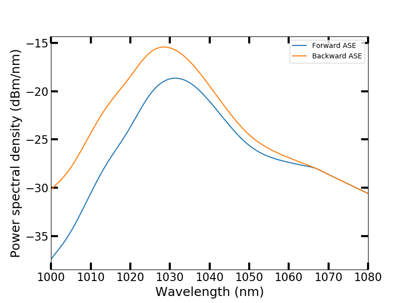

===========================
 Introduction to PyFiberAmp
===========================

PyFiberAmp is a rate equation simulation library for rare-earth-doped fiber amplifiers and fiber lasers partly based on
the Giles model [1]_.

NEW in version 0.5.0:

- Integrated LP mode solver + support for user-defined mode shapes
- Improved plotting functions
- Ability to use fully 2D doping/inversion profiles in the core
- Different background loss for each channel
- Steady state model now supports reflections
- Python 3.9 support for C++ addon
- License change to GPL3

With PyFiberAmp you can simulate:

- Both core-pumped and double-clad fiber amplifiers
- Simple continuous-wave, gain-switched and Q-switched fiber lasers
- Unlimited number of pump, signal and ASE channels
- Limited number of Raman channels
- Arbitrarily time-dependent beams from continuous-wave to nanosecond pulses
- Radially and rotationally varying dopant concentration and inversion
- Any LP mode shapes, including dispersion and effective area estimation using the built-in mode solver
- Also Gaussian, top-hat and user-defined mode shapes

Additional benefits include:

- Built-in plotting commands: easy visualization of results
- Python interface: convenient for post-processing the data
- C++, Numba and Pythran backends: fast time-dynamic simulations
- Open source: see what's happening under the hood
- Free of charge: install on as many computers as you like

Documentation is still in progress and available at `pyfiberamp.com <https://pyfiberamp.com>`_.
For practical examples, see the examples folder above. If you have a question, comment or feature request, please open a new issue on
GitHub or contact me at pyfiberamp@gmail.com. If you find PyFiberAmp useful in your own project, I would also very much
like to hear about it.

A visual example
=================
Few-nanosecond pulses propagating in an Yb-doped fiber amplifier are distorted because of gain saturation.
The Gaussian pulse with its exponential leading edge retains its shape better than the square or saw-tooth
pulses.

Download
=========
PyFiberAmp is not yet on PyPI. You can either download the code as a zip-file or clone the repository with
::

    git clone git://github.com/Jomiri/pyfiberamp.git

and then install the library by executing
::

    python setup.py install

in the (unzipped) download directory.

System requirements
===================
PyFiberAmp depends on the standard scientific Python packages: Numpy, SciPy and Matplotlib and has been
tested on Windows 7 and Windows 10. It should work on other operating systems as well
provided that Python and the required packages are installed. The `Anaconda distribution
<https://www.anaconda.com/download/>`_ contains everything you'll need out of the box.

Even though all of PyFiberAmp's functionality is available in interpreted Python code, the use of one of the compiled
backends (C++, Numba or Pythran) is recommended for computationally intensive time-dynamic simulations.
The hand-written C++ extension is fastest but has also the strictest system requirements: Windows 7 or 10, Python 3.9 and a fairly modern
CPU with AVX2 instruction support. The Pythran backend probably only works on Linux and requires that `pythran <https://pythran.readthedocs.io/en/latest/>`_
is installed before installing PyFiberAmp. The Numba backend should work on all operating systems provided that `Numba <https://numba.pydata.org/>`_
is available. Please open a new issue if you encounter problems with a backend that should work but does not.

Note that the C++ extension has been bumped to support Python 3.9 in version 0.5.0.

Example
========
The simple example below demonstrates a core-pumped Yb-doped fiber amplifier. All units are in SI.
::

    from pyfiberamp.steady_state import SteadyStateSimulation
    from pyfiberamp.fibers import YbDopedFiber

    yb_number_density = 2e25  # m^-3
    core_radius = 3e-6  # m
    length = 2.5  # m
    core_na = 0.12

    fiber = YbDopedFiber(length=length,
                         core_radius=core_radius,
                         ion_number_density=yb_number_density,
                         background_loss=0,
                         core_na=core_na)
    simulation = SteadyStateSimulation(fiber=fiber)

    simulation.add_forward_signal(wl=1035e-9, input_power=2e-3)
    simulation.add_forward_pump(wl=976e-9, input_power=300e-3)
    simulation.add_ase(wl_start=1000e-9, wl_end=1080e-9, n_bins=80)

    result = simulation.run(tol=1e-5)
    result.plot()

The script calculates and plots the power evolution in the amplifier and the amplified spontaneous emission (ASE)
spectra. The co-propagating pump is absorbed in the first ~1.2 m of the fiber while the signal experiences gain.
When the pump has been depleted, the signal starts to be reabsorbed. ASE is stronger against the pumping direction.

For more usage examples, please see the Jupyter notebooks in the examples folder. More examples will be added in the
future.

Fiber data
==========
PyFiberAmp comes with spectroscopic data (effective absorption and emission cross sections) for Yb-doped germanosilicate
fibers [3]_ and supports importing spectra for other dopants and glass compositions.

Theory basics
==============
For a quick review on the theory, see the `pyfiberamp theory.pdf
<https://github.com/Jomiri/pyfiberamp/blob/master/pyfiberamp%20theory.pdf>`_ file. Theory on the time-dynamic
simulations is not yet included. A more complete description can be found in the references.

License
========
As of version 0.5.0 PyFiberAmp is licensed under the GPL3 license. The C++ extension depends on the `pybind11
<https://github.com/pybind/pybind11>`_  and `Armadillo <http://arma.sourceforge.net/>`_ projects. See the license file
for their respective licenses.

References
===========
.. [1] C.R. Giles and E. Desurvire, "Modeling erbium-doped fiber amplifiers," in Journal of Lightwave Technology, vol. 9, no. 2, pp. 271-283, Feb 1991. doi: 10.1109/50.65886
.. [2] R.G. Smith, "Optical Power Handling Capacity of Low Loss Optical Fibers as Determined by Stimulated Raman and Brillouin Scattering," Appl. Opt. 11, 2489-2494 (1972)
.. [3] R. Paschotta, J. Nilsson, A. C. Tropper and D. C. Hanna, "Ytterbium-doped fiber amplifiers," in IEEE Journal of Quantum Electronics, vol. 33, no. 7, pp. 1049-1056, Jul 1997. doi: 10.1109/3.594865
