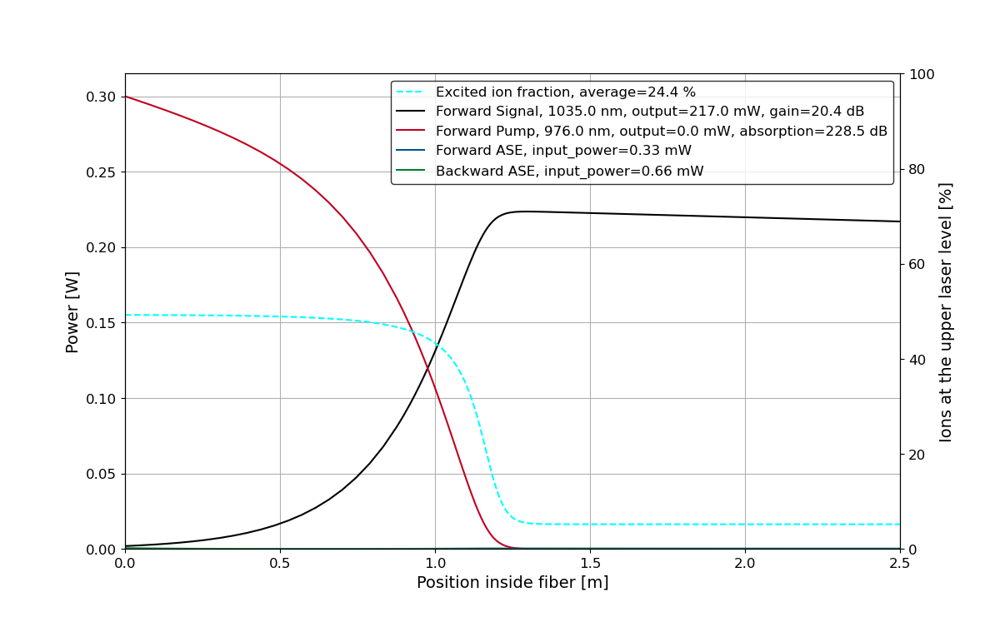
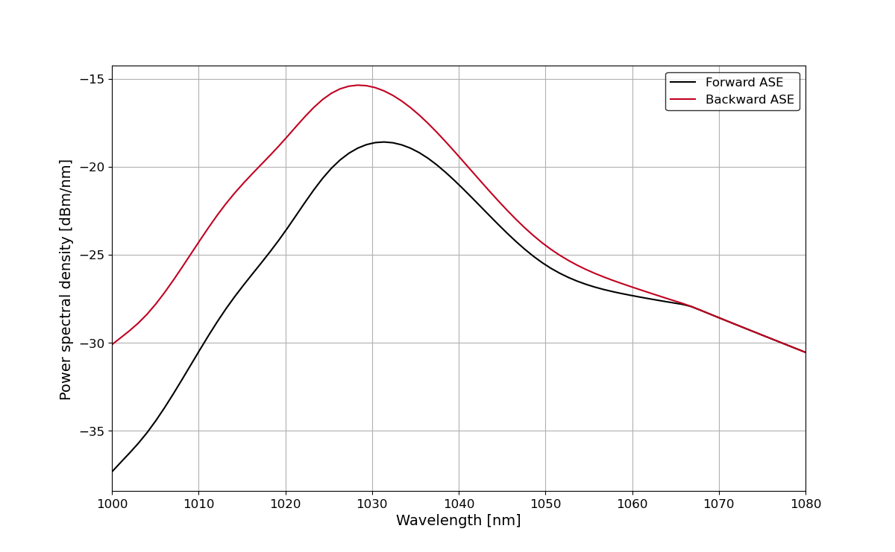

===========================
 Introduction to PyFiberAmp
===========================

In short
============
PyFiberAmp is a rate equation simulation library for rare earth fiber amplifiers. It uses the Giles model [1]_
originally developed for erbium-doped fiber amplifiers. The library also contains a basic rate equation model [2]_
for stimulated and spontaneous Raman scattering effects in both active and passive fibers. Both core-pumped and
double-clad amplifiers can be modeled. Documentation (still in progress) is available on
`Read the Docs <https://pyfiberamp.readthedocs.io/en/latest/index.html>`_.

Download
=========
PyFiberAmp is not yet on PyPI. You can clone the repository with
::

    $ git clone git://github.com/Jomiri/pyfiberamp.git

and then install the library with
::

    python setup.py install

Example
========
The simple example below demonstrates a core-pumped Yb-doped fiber amplifier. All units are in SI.
::

    from pyfiberamp import FiberAmplifierSimulation
    from pyfiberamp.fibers import YbDopedFiber

    yb_number_density = 2e25 # m^-3
    core_r = 3e-6
    background_loss = 0
    length = 2.5 # m
    core_na = 0.12
    tolerance = 1e-5

    fiber = YbDopedFiber(length=length,
                        core_radius=core_r,
                        ion_number_density=yb_number_density,
                        background_loss=background_loss,
                        core_na=core_na)
    simulation = FiberAmplifierSimulation(fiber)
    simulation.add_cw_signal(wl=1035e-9, power=2e-3)
    simulation.add_forward_pump(wl=976e-9, power=300e-3)
    simulation.add_ase(wl_start=1000e-9, wl_end=1080e-9, n_bins=40)

    result = simulation.run(tol=tolerance)
    assert(result.success())
    result.plot_amplifier_result()

The script plots the power evolution in the amplifier and the amplified spontaneous emission (ASE) spectra. The
co-propagating pump is absorbed in the first ~1.8 m while the signal experiences gain. When the pump has been depleted,
the signal starts to be reabsorbed by the fiber. This design is not perfect 1) because the fiber is too long and
2) because the input signal is too weak to saturate the gain at the start of the fiber.

For more usage examples, please see `the Jupyter notebook
<https://github.com/Jomiri/pyfiberamp/blob/master/Examples.ipynb>`_.

Fiber data
==========
PyFiberAmp comes with spectroscopic data (absorption and emission cross sections) for Yb-doped germanosilicate fibers
[3]_ and supports importing spectra for other dopants/glass-compositions.

Theory basics
==============
For a quick view on the theory, see the `pyfiberamp theory.pdf
<https://github.com/Jomiri/pyfiberamp/blob/master/pyfiberamp%20theory.pdf>`_ file. A more complete description can be found in the
references.

License
========
PyFiberAmp is licensed under the MIT license.

References
===========
.. [1] C.R. Giles and E. Desurvire, "Modeling erbium-doped fiber amplifiers," in Journal of Lightwave Technology, vol. 9, no. 2, pp. 271-283, Feb 1991. doi: 10.1109/50.65886
.. [2] R.G. Smith, "Optical Power Handling Capacity of Low Loss Optical Fibers as Determined by Stimulated Raman and Brillouin Scattering," Appl. Opt. 11, 2489-2494 (1972)
.. [3] R. Paschotta, J. Nilsson, A. C. Tropper and D. C. Hanna, "Ytterbium-doped fiber amplifiers," in IEEE Journal of Quantum Electronics, vol. 33, no. 7, pp. 1049-1056, Jul 1997. doi: 10.1109/3.594865
